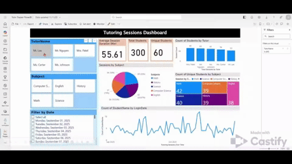

# 🎓 Tutoring Sessions Dashboard (Power BI)

  

This project showcases a clean, interview-ready **Power BI dashboard** built from a synthetic dataset of tutoring sessions (Sept–Oct 2025). It’s designed to demonstrate core dashboarding skills: data modeling, KPI design, interactive filtering, and clear visual storytelling.

---

## 📂 Dataset

**File:** `tutoring_login_data_300.csv`  
**Rows:** 300 (one row per tutoring session)

**Columns:**

- `StudentName` – Pseudonymized student identifier  
- `TutorName` – Assigned tutor for the session  
- `Subject` – Subject tutored (Math, Science, English, History, Computer Science)  
- `LoginDate` – Session date  
- `SessionDuration(min)` – Length of the session in minutes  

Dataset is intentionally clean and structured to focus on **Power BI skills**, not heavy data cleaning.

---

## 📊 Dashboard Overview

**File:** `Tutoring_Sessions_Dashboard.pbix`

The report includes:

1. **KPI Cards**
   - **Total Sessions** – Overall tutoring volume  
   - **Unique Students** – Reach / engagement  
   - **Average Session Duration (Minutes)** – Session quality & consistency

2. **Visuals**
   - **Sessions Over Time (Line Chart)**  
     - Daily trend of tutoring sessions across Sept–Oct 2025
   - **Sessions by Tutor (Bar Chart)**  
     - Comparison of tutoring load across tutors
   - **Sessions by Subject (Pie Chart + Treemap)**  
     - Distribution of demand by subject area
   - **Interactive Slicers**
     - Filter by **Tutor**
     - Filter by **Subject**
     - Filter by **Date**

These elements demonstrate:

- Time-series analysis  
- Categorical comparisons  
- Proportional breakdowns  
- KPI design & layout  
- Cross-filtering & user interactivity

---

## 🔗 How to View the Report

### Option 1 – Open the `.pbix` file
1. Install **Power BI Desktop** (free from Microsoft Store).
2. Download `Tutor Tracker PowerBI.pbix` from this repo.
3. Open it in Power BI Desktop to explore all visuals and slicers interactively.

### Option 2 – View online (if you have Power BI access)
If you have access to Power BI Service:

- Open the secure report link (for org/tenant users only):  

> Note: Public “Publish to web” is disabled for this tenant, so a valid Power BI account is required.
